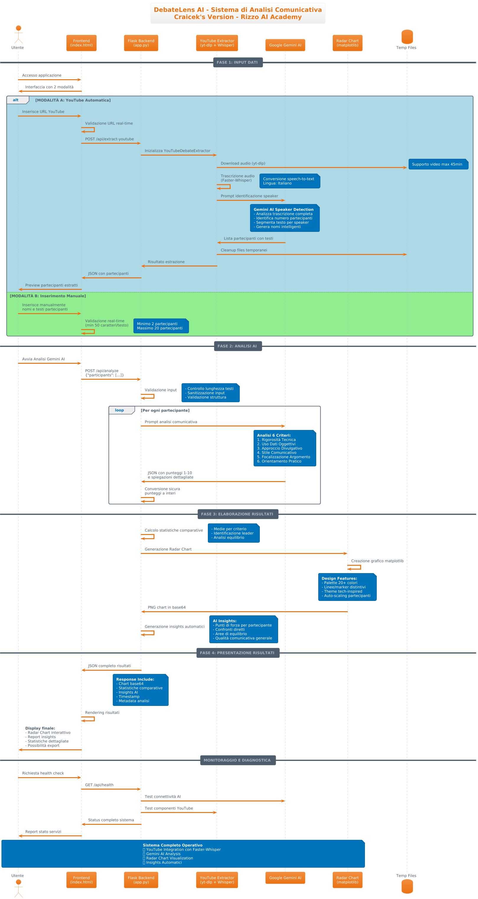

# DebateLens AI - Sistema Avanzato di Analisi Comunicativa

[](https://www.python.org/)
[](https://flask.palletsprojects.com/)
[](https://ai.google.dev/gemini)
[](https://www.rizzoaiacademy.com)

**Craicek's Version** - Sviluppato per Rizzo AI Academy

---

## 🎯 Panoramica del Progetto

**DebateLens AI** è un'applicazione web avanzata basata su Flask progettata per eseguire **analisi comparative della comunicazione** utilizzando l'intelligenza artificiale di Google Gemini. Sviluppata come "Craicek's Version" per la Rizzo AI Academy, l'applicazione valuta automaticamente i testi di diversi partecipanti su 6 criteri comunicativi specifici.

L'obiettivo principale è fornire un'**analisi obiettiva e dettagliata** di come i diversi oratori comunicano, evidenziando punti di forza e debolezze attraverso metriche scientificamente validate e visualizzazioni grafiche avanzate.

## ✨ Funzionalità Principali

### 🤖 **Analisi AI Avanzata**
- Utilizza **Google Gemini AI** (`gemini-1.5-flash`) per analisi contestuale approfondita
- Assegnazione automatica di punteggi da 1-10 per ogni criterio
- Generazione di spiegazioni dettagliate per ogni valutazione

### 🎥 **Estrazione YouTube con AI**
- **Integrazione YouTube completa** con `yt-dlp` per download automatico
- **Trascrizione audio** con `faster-whisper` o `whisper` standard
- **Identificazione intelligente partecipanti** tramite Gemini AI
- **Riconoscimento automatico speaker** con analisi contestuale
- **Supporto video fino a 45 minuti** di durata

### 📊 **Metriche di Valutazione**
Il sistema analizza la comunicazione su **6 criteri chiave**:

1. **Rigorosità Tecnica** - Precisione terminologica e concetti specialistici
2. **Uso di Dati Oggettivi** - Statistiche, ricerche, fonti verificabili
3. **Approccio Divulgativo** - Accessibilità, esempi, analogie
4. **Stile Comunicativo** - Fluidità e capacità di coinvolgimento
5. **Focalizzazione Argomento** - Aderenza al tema, coerenza logica
6. **Orientamento Pratico** - Soluzioni concrete, applicabilità

### 🎨 **Visualizzazione Avanzata**
- **Radar Chart comparativo** con palette di 20+ colori distintivi
- **Design tech-inspired** con gradiente rosso-oro
- **Gestione automatica** di layout per 2-20+ partecipanti
- **Distinzione visiva** tramite colori, linee e marker diversi

### 📈 **Report Intelligenti**
- **Statistiche comparative** automatiche per ogni criterio
- **Insights AI** con identificazione automatica di punti di forza
- **Analisi di equilibrio** tra partecipanti
- **Export timestamp** per tracciabilità

### 🌐 **API RESTful**
- Endpoint `/api/analyze` per analisi batch
- Endpoint `/api/extract-youtube` per estrazione YouTube
- Formato JSON standardizzato per integrazione
- Health check su `/api/health` e `/api/health-youtube`
- Gestione errori robusta con diagnostica dettagliata

## 🚀 Installazione e Configurazione

### Prerequisiti
- **Python 3.9+**
- **Git**
- **FFmpeg** (per YouTube integration)
- **Account Google AI Studio** per API key

### 1. Clone del Repository
```bash
git clone https://github.com/tuousername/DebateLens.git
cd DebateLens
```

### 2. Ambiente Virtuale
```bash
python -m venv venv

# Windows
venv\Scripts\activate

# macOS/Linux
source venv/bin/activate
```

### 3. Dipendenze
```bash
pip install -r requirements.txt
```

### 4. Installazione FFmpeg (per YouTube)
```bash
# Windows
choco install ffmpeg
# oppure
winget install Gyan.FFmpeg

# macOS
brew install ffmpeg

# Ubuntu/Debian
sudo apt install ffmpeg
```

### 5. Configurazione API Key
1. Vai su [Google AI Studio](https://aistudio.google.com/app/apikey)
2. Genera la tua API Key
3. Crea file `.env` nella root del progetto:

```env
# Google AI API Key (obbligatoria)
GOOGLE_API_KEY=la_tua_api_key_qui

# Flask Configuration
FLASK_DEBUG=True
FLASK_HOST=0.0.0.0
FLASK_PORT=5000

# Gemini Configuration
GEMINI_MODEL=gemini-1.5-flash
GEMINI_TEMPERATURE=0.2
GEMINI_MAX_TOKENS=1200
```

### 6. Avvio Applicazione
```bash
python app.py
```

L'applicazione sarà disponibile su `http://localhost:5000`

## 💻 Utilizzo dell'API

### Analisi Dibattiti
**POST** `/api/analyze`

#### Request Body
```json
{
  "participants": [
    {
      "name": "Mario Rossi",
      "text": "Il testo del discorso del primo partecipante..."
    },
    {
      "name": "Anna Verdi", 
      "text": "Il testo del discorso del secondo partecipante..."
    }
  ]
}
```

#### Response
```json
{
  "success": true,
  "timestamp": "20241222_144530",
  "participants_count": 2,
  "chart_data": "base64_encoded_png_image",
  "report": {
    "summary": {
      "rigorosita_tecnica": {
        "average": 7.5,
        "max_participant": "Mario Rossi",
        "max_score": 8
      }
    },
    "detailed_comparison": {
      "Mario Rossi": {
        "scores": { "rigorosita_tecnica": 8 },
        "explanations": { "rigorosita_tecnica": "Spiegazione dettagliata" }
      }
    },
    "insights": [
      "🔥 Mario Rossi eccelle in Rigorosità Tecnica (8/10)",
      "⚡ Anna Verdi si distingue per: approccio divulgativo"
    ]
  },
  "version": "DebateLens Craicek's Version",
  "powered_by": "Google Gemini AI"
}
```

### Estrazione YouTube
**POST** `/api/extract-youtube`

#### Request Body
```json
{
  "youtube_url": "https://www.youtube.com/watch?v=..."
}
```

#### Response
```json
{
  "success": true,
  "video_title": "Titolo del video",
  "participants": [
    {
      "name": "Speaker A",
      "text": "Trascrizione del primo speaker...",
      "detection_method": "gemini_ai",
      "confidence": "alta",
      "role": "Moderatore"
    }
  ],
  "whisper_type": "faster",
  "gemini_powered": true
}
```

## 🛠️ Architettura Tecnica

### Backend (Flask)
- **Gestione robusta dei tipi** con validazione automatica
- **Conversione sicura** da stringhe AI a numeri interi
- **Error handling** completo con logging dettagliato
- **Matplotlib** per generazione grafici server-side

### YouTube Integration
- **yt-dlp** per download video YouTube
- **Faster-Whisper** (raccomandato) o Whisper standard per trascrizione
- **Gemini AI** per identificazione intelligente speaker
- **Riconoscimento automatico** di ruoli e contesti

### AI Integration
- **Google Gemini 1.5 Flash** per analisi testuale
- **Prompt engineering** ottimizzato per consistenza
- **Temperature 0.2** per output deterministici
- **JSON schema validation** per struttura dati

### Frontend (Vanilla JS)
- **Validazione real-time** con feedback visivo
- **Interfaccia responsive** ottimizzata per mobile
- **Integrazione YouTube** con progress indicator
- **Animazioni fluide** con CSS3 e JavaScript

## 📋 Requisiti di Sistema

### Dipendenze Principali
```
Flask==3.1.1
google-generativeai==0.8.5
matplotlib==3.10.3
numpy==2.3.1
python-dotenv==1.1.0
flask-cors==6.0.1
yt-dlp==2025.6.9
faster-whisper
```

### Specifiche Tecniche
- **Memoria**: 1GB+ disponibili (per YouTube processing)
- **CPU**: Supporto multi-core raccomandato
- **Storage**: 500MB per installazione completa
- **Network**: Connessione internet per API Google e YouTube

## 🔧 Configurazione Avanzata

### Variabili Ambiente (.env)
```env
# Google AI API Key (obbligatoria)
GOOGLE_API_KEY=your_api_key_here

# Flask Configuration
FLASK_DEBUG=False
FLASK_HOST=0.0.0.0
FLASK_PORT=5000

# Gemini Configuration
GEMINI_MODEL=gemini-1.5-flash
GEMINI_TEMPERATURE=0.2
GEMINI_MAX_TOKENS=1200

# Logging
LOG_LEVEL=INFO
LOG_FILE=debatelens.log
```

### Personalizzazione Palette Colori
Modifica il file `app.py`, funzione `create_radar_chart()`:

```python
colors = [
    '#dc2626',  # Rosso primario
    '#fbbf24',  # Oro tech
    '#custom',  # Il tuo colore personalizzato
    # ... altri colori
]
```

## 🧪 Testing e Validazione

### Health Check
```bash
# Health check generale
curl http://localhost:5000/api/health

# Health check YouTube + Gemini
curl http://localhost:5000/api/health-youtube

# Test YouTube Integration
curl -X POST http://localhost:5000/api/youtube-test
```

### Test Completo
```bash
# Test analisi manuale
curl -X POST http://localhost:5000/api/analyze \
  -H "Content-Type: application/json" \
  -d '{"participants":[{"name":"Test","text":"Testo di prova lungo almeno cinquanta caratteri per superare la validazione minima"}]}'

# Test estrazione YouTube
curl -X POST http://localhost:5000/api/extract-youtube \
  -H "Content-Type: application/json" \
  -d '{"youtube_url":"https://www.youtube.com/watch?v=YOUR_VIDEO_ID"}'
```

### Validazioni Implementate
- ✅ **Lunghezza minima testo**: 50 caratteri
- ✅ **Campi obbligatori**: nome e testo per ogni partecipante
- ✅ **Range punteggi**: 1-10 per tutti i criteri
- ✅ **Formato JSON**: validazione struttura response
- ✅ **Gestione errori**: timeout, connessione, parsing

## 🐛 Troubleshooting

### Problemi Comuni

#### API Key non funziona
```bash
# Verifica configurazione
echo $GOOGLE_API_KEY

# Test diretto API
curl -X POST https://generativelanguage.googleapis.com/v1beta/models/gemini-1.5-flash:generateContent?key=$GOOGLE_API_KEY
```

#### YouTube Integration fallisce
```bash
# Verifica FFmpeg
ffmpeg -version

# Test yt-dlp
yt-dlp --version

# Test Whisper
python -c "from faster_whisper import WhisperModel; print('OK')"
```

#### Errori matplotlib
```bash
# Reinstalla matplotlib
pip uninstall matplotlib
pip install matplotlib

# Linux: installa dipendenze sistema
sudo apt-get install python3-dev python3-matplotlib
```

#### Port già in uso
```bash
# Trova processo su porta 5000
lsof -i :5000
kill -9 <PID>

# Oppure cambia porta
export FLASK_PORT=8080
python app.py
```

## 📈 Performance e Scalabilità

### Ottimizzazioni Implementate
- **Caching matplotlib** con cleanup automatico
- **Validazione input** pre-processing
- **Error handling** senza blocking
- **Memory management** per grafici e audio

### Limiti Attuali
- **Video YouTube**: Massimo 45 minuti
- **Concorrenza**: Single-threaded Flask dev server
- **Rate limiting**: Dipende da quota Google API
- **Memoria**: ~200MB per video complesso

### Scaling per Produzione
```bash
# Usa Gunicorn per produzione
gunicorn --workers 4 --bind 0.0.0.0:5000 app:app

# Oppure uvicorn per async
uvicorn app:app --host 0.0.0.0 --port 5000 --workers 4
```

## 🤝 Contributi e Sviluppo

### Struttura Progetto
```
DebateLens/
├── app.py              # Flask application principale
├── index.html          # Frontend SPA
├── requirements.txt    # Dipendenze Python
├── .env.example       # Template configurazione
├── .gitignore         # Git ignore rules
└── README.md          # Questa documentazione
```

### Workflow di Sviluppo
1. **Fork** del repository
2. **Feature branch**: `git checkout -b feature/nome-feature`
3. **Commit** con messaggi descrittivi
4. **Test** locale completo (incluso YouTube)
5. **Pull Request** con descrizione dettagliata

### Code Style
- **PEP 8** per Python
- **ESLint** per JavaScript
- **Docstrings** per tutte le funzioni
- **Type hints** quando possibile

## 📄 Licenza e Credits

### Sviluppo
- **Craicek** - Sviluppatore principale
- **Rizzo AI Academy** - Formazione e sviluppo AI

### Tecnologie
- **Google Gemini AI** - Motore di analisi e riconoscimento speaker
- **Flask** - Web framework
- **Matplotlib** - Visualizzazione grafici
- **yt-dlp** - Download YouTube
- **Faster-Whisper** - Trascrizione audio AI
- **Bootstrap styling** - CSS framework base

---

## 🔥 Versioni e Changelog

### v2.0.0 (Craicek's Gemini Enhanced Version)
- ✅ **YouTube Integration completa** con yt-dlp
- ✅ **Faster-Whisper** per trascrizione ottimizzata
- ✅ **Gemini AI Speaker Detection** intelligente
- ✅ **Identificazione automatica partecipanti** con contesto
- ✅ **Analisi AI completa** con Google Gemini
- ✅ **Radar chart** con 20+ colori distintivi
- ✅ **Sistema di validazione** robusto
- ✅ **Interface responsive** con progress indicators
- ✅ **API RESTful** per integrazioni complete

### v1.0.0 (Base Version)
- ✅ **Analisi AI** con Google Gemini
- ✅ **Radar chart** base
- ✅ **Validazione** input
- ✅ **Interface** web basic

---

## 🎯 Esempi di Utilizzo

### Caso d'uso 1: Analisi Dibattito Politico
```python
# URL YouTube di un dibattito
youtube_url = "https://www.youtube.com/watch?v=political_debate"

# Il sistema automaticamente:
# 1. Scarica l'audio del video
# 2. Trascrive con Whisper AI
# 3. Identifica i candidati con Gemini AI
# 4. Segmenta il testo per ogni speaker
# 5. Analizza stile comunicativo
# 6. Genera report comparativo
```

### Caso d'uso 2: Valutazione Intervista Tecnica
```python
# Il sistema può analizzare:
# - Precisione terminologica del candidato
# - Uso di esempi pratici
# - Capacità comunicative
# - Focalizzazione sulle domande
# - Orientamento verso soluzioni concrete
```

### Caso d'uso 3: Assessment Presentazioni Corporate
```python
# Analisi automatica di:
# - Chiarezza espositiva
# - Uso di dati supportivi
# - Capacità divulgative
# - Coinvolgimento audience
# - Struttura logica del discorso
```

---

## 🚀 Quick Start Guide

### Installazione Rapida
```bash
# 1. Clone e setup
git clone https://github.com/tuousername/DebateLens.git
cd DebateLens
python -m venv venv
source venv/bin/activate  # Windows: venv\Scripts\activate

# 2. Installa dipendenze
pip install -r requirements.txt

# 3. Configura API Key
echo "GOOGLE_API_KEY=your_api_key_here" > .env

# 4. Avvia
python app.py
```

### Test Rapido
```bash
# Verifica tutto funzioni
curl http://localhost:5000/api/health

# Test con dati di esempio
curl -X POST http://localhost:5000/api/analyze \
  -H "Content-Type: application/json" \
  -d '{"participants":[{"name":"Alice","text":"Questo è un testo di esempio per testare il sistema di analisi della comunicazione."},{"name":"Bob","text":"Ecco un altro esempio di testo che verrà analizzato dal sistema per confrontare gli stili comunicativi."}]}'
```

---

## 🔍 Funzionalità Avanzate

### Configurazione Multi-Environment
```bash
# Development
export FLASK_ENV=development
export GEMINI_TEMPERATURE=0.3

# Production
export FLASK_ENV=production
export GEMINI_TEMPERATURE=0.1
```

### Monitoring e Logging
```python
# app.py include logging avanzato
import logging
logging.basicConfig(
    level=logging.INFO,
    format='%(asctime)s - %(name)s - %(levelname)s - %(message)s',
    handlers=[
        logging.FileHandler('debatelens.log'),
        logging.StreamHandler()
    ]
)
```

### Batch Processing
```bash
# Per processare molti video YouTube
for url in $(cat youtube_urls.txt); do
  curl -X POST http://localhost:5000/api/extract-youtube \
    -H "Content-Type: application/json" \
    -d "{\"youtube_url\":\"$url\"}"
  sleep 5  # Rate limiting
done
```

---

## 🎨 Personalizzazione UI

### Modifica Colori Tema
```css
/* Modifica index.html per personalizzare i colori */
:root {
  --primary-color: #dc2626;    /* Rosso principale */
  --secondary-color: #fbbf24;  /* Oro tech */
  --accent-color: #your-color; /* Il tuo colore */
}
```

### Aggiunta Nuovi Criteri
```python
# In app.py, modifica la lista dei criteri
self.analysis_criteria = [
    'rigorosita_tecnica',
    'uso_dati_oggettivi', 
    'approccio_divulgativo',
    'stile_comunicativo',
    'focalizzazione_argomento',
    'orientamento_pratico',
    'nuovo_criterio'  # Aggiungi qui
]
```

---
### ARCHITETTURA




<div align="center">

**⚡ Sviluppato da CRAICEK per Rizzo AI Academy**

[](https://github.com/tuousername/DebateLens)
[](https://github.com/tuousername/DebateLens/wiki)
[](http://your-demo-url.com)

**🤖 Powered by Google Gemini AI • 🎥 YouTube Integration • 🎙️ Faster-Whisper AI**

*Versione 2.0.0 - Craicek's Edition*

</div>
